# 🏦 Aurora Banking Performance Dashboard | Power BI

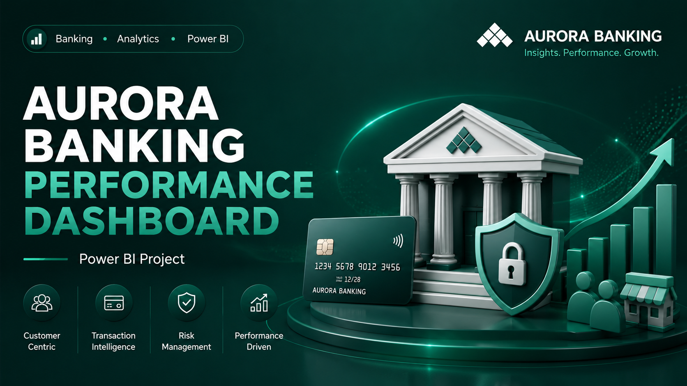

**Author:** Phan Minh Tan  
**Tools Used:** Power BI, Power Query, DAX, Design Thinking  
**Domain:** Retail Banking Analytics  

---

## 📌 Background & Overview

### Objective

This project builds an **Aurora Banking Performance Dashboard** to help the Head of Retail Banking monitor customer activity, transaction performance, merchant behavior, and risk signals in one centralized Power BI report.

The dashboard focuses on one main business question:

> **How can Aurora Banking grow transaction value while keeping customer quality and risk under control?**

### What is this project about?

Aurora Banking needs to understand whether transaction growth is healthy, sustainable, and aligned with credit-risk quality. Instead of only tracking transaction volume, the dashboard connects customer activity, transaction success, merchant performance, card usage, credit score, and failed transaction behavior.

The analysis supports the business in answering:

- How is overall banking performance trending?
- Which customer segments generate the most value and growth potential?
- Where does transaction performance vary across channels and merchants?
- Which segments show the highest risk and require attention?
- What actions should be prioritized by business, operations, and risk teams?

### Who is this project for?

The main stakeholder is the **Head of Retail Banking**.

This stakeholder needs a dashboard to:

- Monitor business performance across customers, transactions, merchants, and risk.
- Identify valuable customer segments for growth.
- Detect weak or risky transaction patterns early.
- Understand which merchant categories and card types drive transaction value.
- Support weekly/monthly reviews with Business, Operations, and Risk teams.

### Project Outcome

The final Power BI dashboard includes five main pages:

- **Overview** – Track total performance, VPAC, active customers, transaction value, transaction volume, success rate, card type, channel mix, and credit-score contribution.
- **Customer Segment** – Identify which customer segments generate the most value and where growth potential exists.
- **Merchant** – Analyze merchant categories, channels, card types, and transaction behavior.
- **Risk** – Monitor failed transactions, insufficient balance, high-risk customers, and risky segments.
- **Insight** – Summarize key business findings and recommended areas of attention.

---

## 🧠 Design Thinking Process

The dashboard was designed using a Design Thinking approach to make sure the analysis starts from stakeholder needs before moving into dashboard design.

### 1️⃣ Empathize - 5W1H

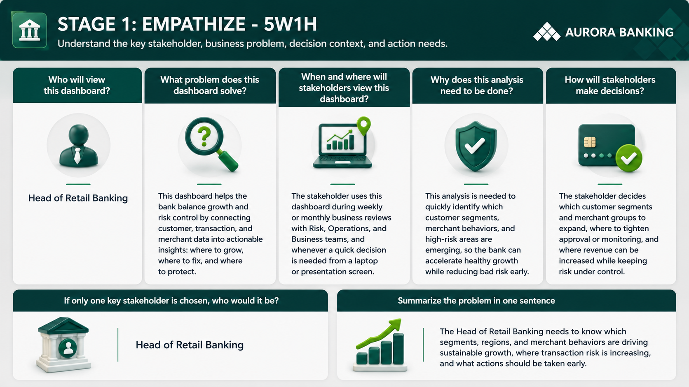

The 5W1H stage defines the key stakeholder, dashboard purpose, decision context, and expected business actions.  
The main stakeholder is the **Head of Retail Banking**, who needs to balance customer growth, transaction performance, and risk control.

### 2️⃣ Empathy Map

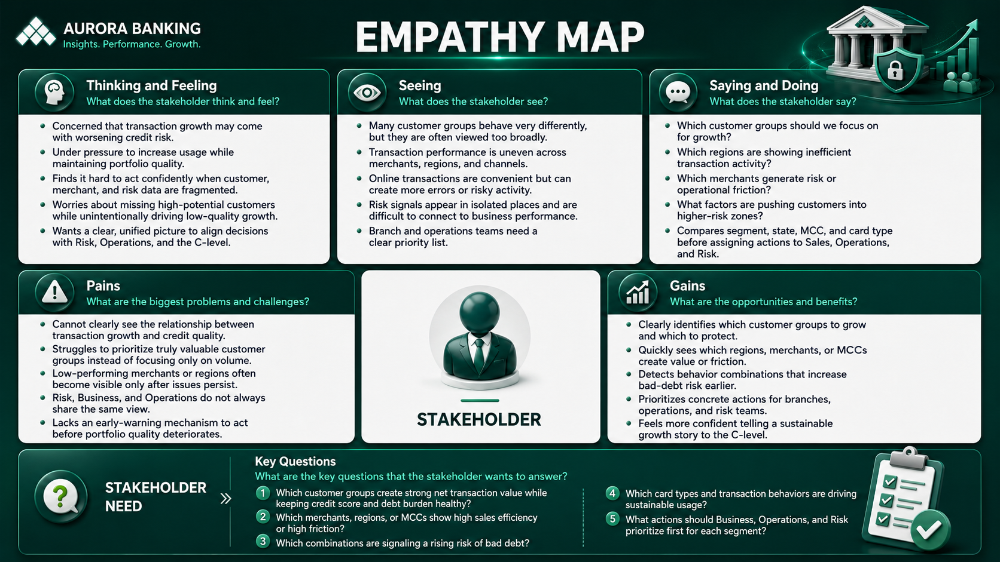

The empathy map captures what the stakeholder thinks, sees, says, and needs.  
The main pain point is that growth, customer behavior, merchant performance, and risk indicators are often viewed separately, making it difficult to decide where to grow, where to fix, and where to protect.

### 3️⃣ Northstar Metric

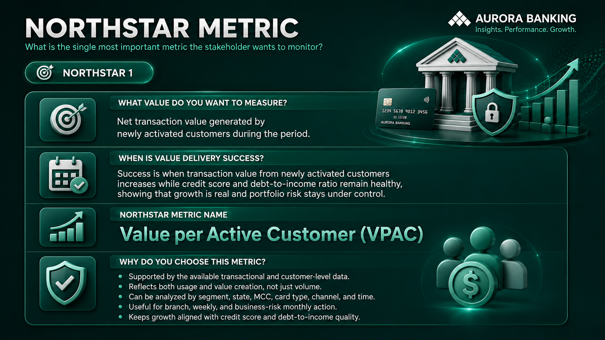

The selected Northstar Metric is:

> **Value per Active Customer (VPAC)**

VPAC was selected because it reflects how much net successful transaction value is generated by each active customer. This metric balances customer activation, transaction value, and portfolio quality instead of focusing only on total transaction volume.

### 4️⃣ Define Point of View & Growth Formula

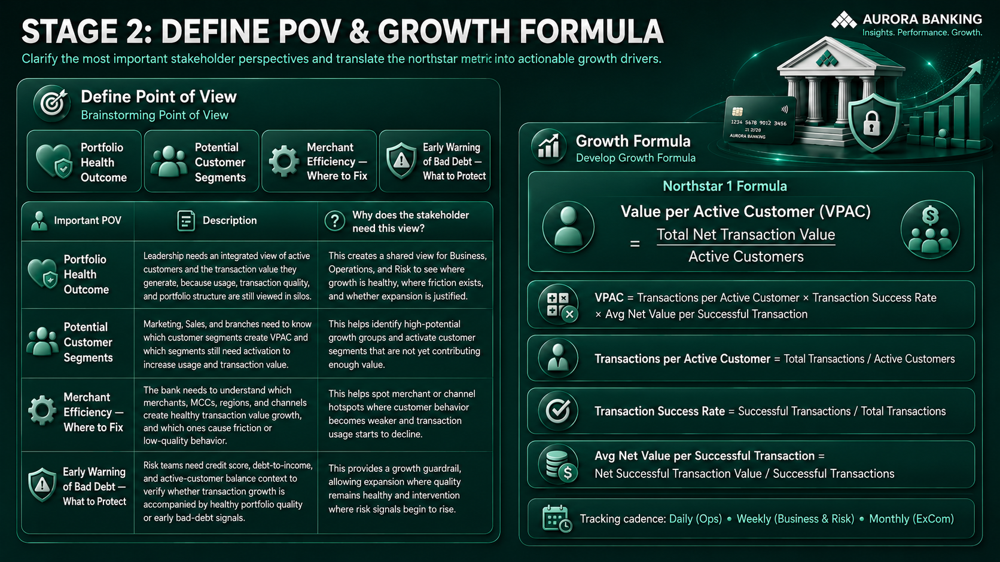

The dashboard is designed around four important points of view:

1. **Portfolio Health Outcome** – Understand whether growth is healthy and sustainable.
2. **Potential Customer Segments** – Identify customer groups with high value or growth opportunity.
3. **Merchant / Region Performance** – Detect where transaction value varies across merchants, regions, and channels.
4. **Credit Risk Warning** – Monitor early signals of failed transactions, insufficient balance, and credit-quality issues.

### 5️⃣ Ideate - Brainstorming

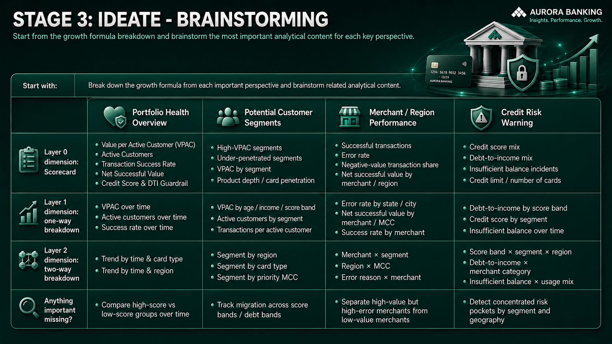

The brainstorming stage breaks down VPAC into measurable components such as active customers, transaction success rate, net successful transaction value, customer segments, merchant behavior, and risk guardrails.

### 6️⃣ Ideate - Structure Idea

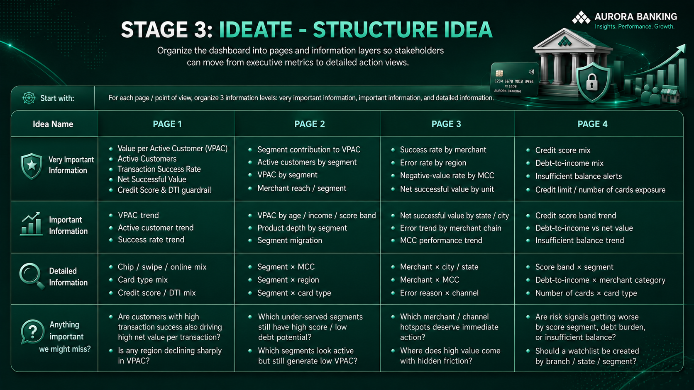

The structure idea stage organizes dashboard pages from executive-level metrics to detailed action views, helping stakeholders move from monitoring to diagnosis and action.

---

## 🧩 Data Model

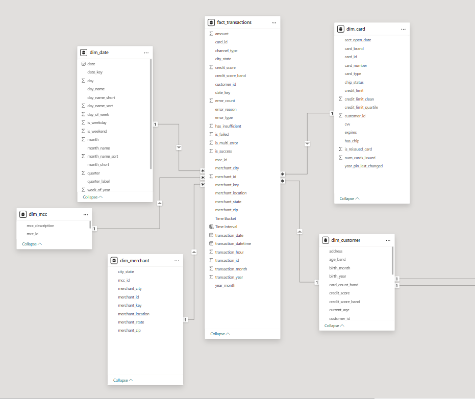

The model connects customer, transaction, card, merchant, channel, region, and risk-related information to support performance and risk analysis.  
Key calculations include VPAC, total transactions, successful transaction value, success rate, failed transaction rate, insufficient balance rate, and customer-level contribution.

---

## 📊 Key Insights & Visualizations

### 📋 I. Overview Page

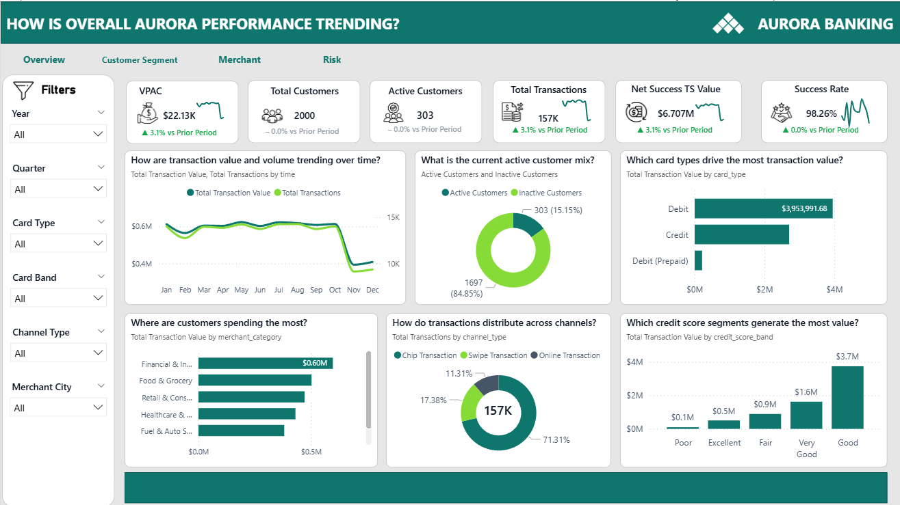

#### Key Findings

- Aurora Banking recorded **157K total transactions** and **$6.707M in Net Successful Transaction Value**, both increasing by **3.1% vs prior period**.
- **VPAC reached $22.13K**, showing how much transaction value each active customer generated during the period.
- The bank has **2,000 total customers**, but only **303 active customers**, meaning active customers account for only **15.15%** of the portfolio while **84.85% remain inactive**.
- The overall **Success Rate is 98.26%**, suggesting transaction quality is generally strong, but risk indicators still need monitoring.
- Debit cards drive the highest transaction value at around **$3.95M**, making Debit the core card type for transaction growth.
- Customers in the **Good credit score band** generate the highest transaction value at around **$3.7M**, far above other score groups.
- Transaction value and transaction volume drop noticeably in **November and December**, indicating a potential year-end slowdown that should be monitored.

---

### 👥 II. Customer Segment Page

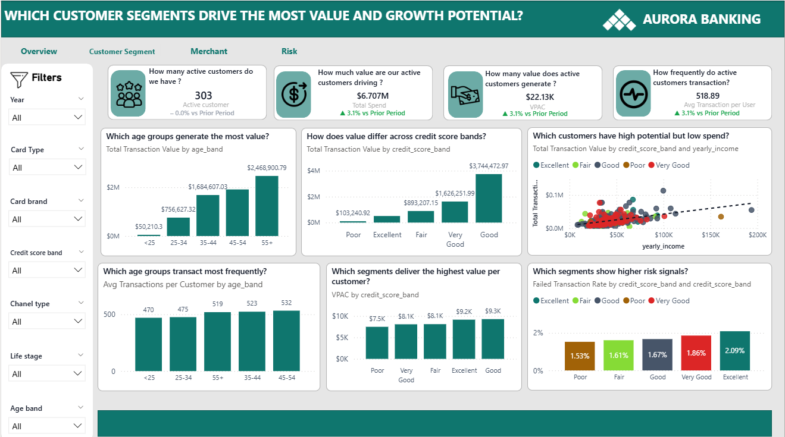

#### Key Findings

- Aurora Banking has **303 active customers** generating **$6.707M** in transaction value, with **VPAC at $22.13K**.
- Active customers make an average of **518.89 transactions per user**, showing strong usage intensity among the active base.
- The **55+ age group** generates the highest transaction value at around **$2.47M**, followed by the **45–54** and **35–44** groups, showing that mature customers are the strongest value drivers.
- Customers in the **Good credit score band** generate the highest transaction value at around **$3.74M**.
- VPAC is highest in the **Good** and **Excellent** credit score bands, at around **$9.3K** and **$9.2K**, suggesting stronger value per customer among healthier credit profiles.
- The **45–54 age group** shows the highest transaction frequency with about **532 average transactions per customer**, followed closely by **35–44** and **55+**.
- Failed Transaction Rate is highest in the **Excellent** credit score band at **2.09%**, showing that even strong credit groups can still generate operational or transaction friction.

---

### 🏪 III. Merchant Page

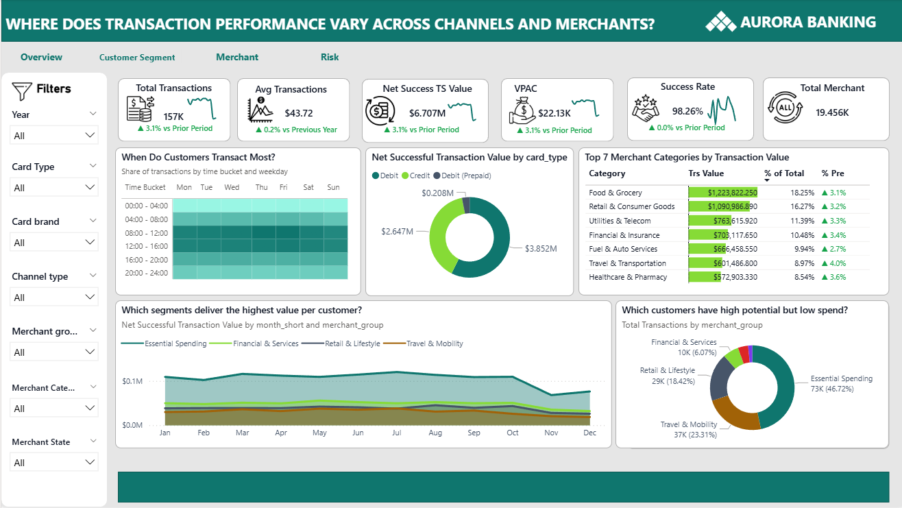

#### Key Findings

- The merchant page shows **157K total transactions**, **$6.707M Net Successful Transaction Value**, **$22.13K VPAC**, and a **98.26% Success Rate**.
- The average transaction value is **$43.72**, slightly increasing by **0.2% vs previous year**.
- Debit contributes the largest transaction value at around **$3.85M**, while Credit contributes around **$2.65M** and Prepaid Debit contributes around **$0.21M**.
- **Food & Grocery** is the largest merchant category, generating about **$1.22M**, or **18.25%** of total transaction value.
- **Retail & Consumer Goods** ranks second with about **$1.09M**, or **16.27%** of total transaction value.
- Other important merchant categories include **Utilities & Telecom ($763.6K)**, **Financial & Insurance ($703.1K)**, and **Fuel & Auto Services ($666.5K)**.
- Transaction channel mix is dominated by **Chip Transaction at 71.31%**, followed by **Swipe Transaction at 17.38%** and **Online Transaction at 11.31%**.
- Essential Spending represents the largest high-potential customer behavior group, with about **73K transactions**, accounting for **46.72%** of the selected transaction base.

---

### ⚠️ IV. Risk Page

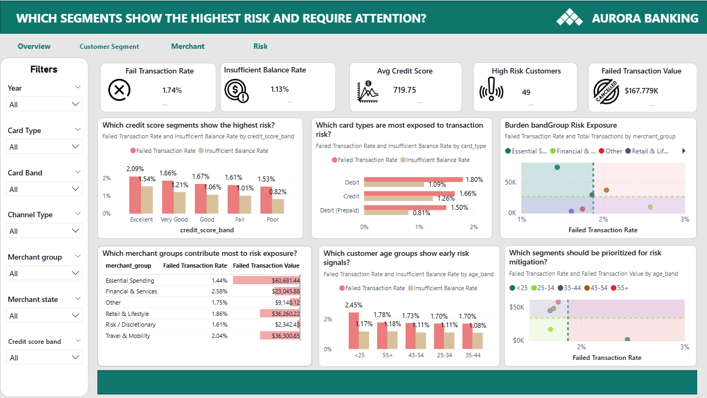

#### Key Findings

- The overall **Failed Transaction Rate is 1.74%**, with **Failed Transaction Value of $167.779K**.
- The **Insufficient Balance Rate is 1.13%**, making insufficient balance one of the key risk drivers to monitor.
- The dashboard identifies **49 high-risk customers**, which should be prioritized for risk review or intervention.
- The average credit score is **719.75**, suggesting the overall portfolio is healthy, but risk pockets still exist.
- By credit score band, **Excellent** customers show the highest Failed Transaction Rate at **2.09%**, followed by **Very Good at 1.86%** and **Good at 1.67%**.
- By card type, **Debit** has the highest Failed Transaction Rate at **1.80%**, while **Credit** has the highest Insufficient Balance Rate at **1.26%**.
- By merchant group, **Financial & Services** has the highest Failed Transaction Rate at **2.58%**, while **Essential Spending** contributes the largest failed transaction value at around **$60.68K**.
- The **<25 age group** shows the highest early risk signal, with a Failed Transaction Rate of **2.45%** and Insufficient Balance Rate of **1.17%**.

---

### 💡 V. Insight Page

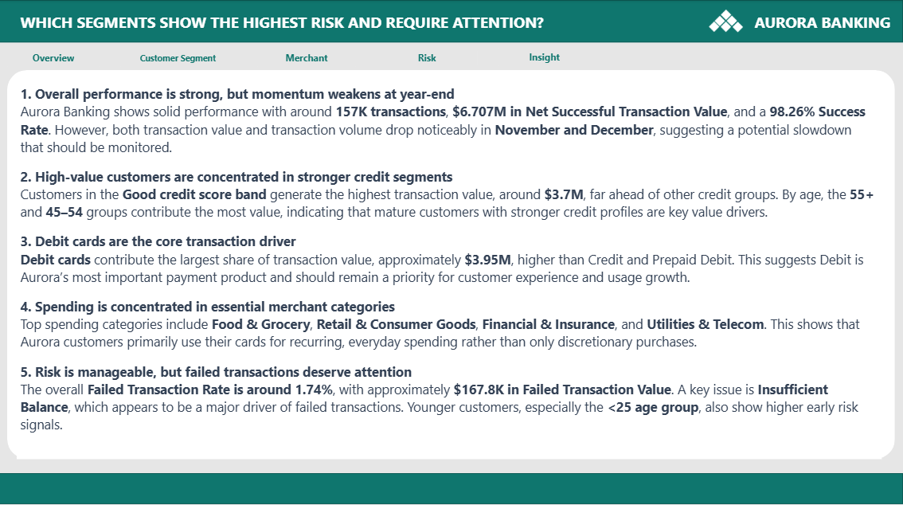

#### Key Findings

- Overall performance is strong with **157K transactions**, **$6.707M in Net Successful Transaction Value**, and a **98.26% Success Rate**.
- Performance momentum weakens at year-end because both transaction value and volume decline in **November and December**.
- High-value customers are concentrated in stronger credit segments, especially the **Good credit score band**, which contributes about **$3.7M** in transaction value.
- Debit cards are the most important payment product, contributing about **$3.95M** in transaction value.
- Customer spending is concentrated in essential categories such as **Food & Grocery**, **Retail & Consumer Goods**, **Financial & Insurance**, and **Utilities & Telecom**.
- Risk is manageable overall, but failed transactions deserve attention because the Failed Transaction Rate is around **1.74%** and Failed Transaction Value is around **$167.8K**.
- Younger customers, especially the **<25 age group**, show higher early risk signals and should be monitored more carefully.

---

## 🔎 Final Conclusion & Recommendation

| Focus Area | Insight | Recommendation |
|---|---|---|
| Portfolio Growth | Aurora Banking shows strong transaction performance with **157K transactions** and **$6.707M Net Successful Transaction Value**. | Continue tracking VPAC and successful transaction value as core business growth metrics. |
| Customer Activation | Only **303 out of 2,000 customers** are active, leaving a large inactive customer base. | Design activation campaigns to convert inactive customers into active users, especially in low-usage but healthy credit segments. |
| Customer Value | Mature customers and the **Good credit score band** generate the highest transaction value. | Prioritize high-value segments for retention, upsell, and personalized banking offers. |
| Card Strategy | Debit cards generate around **$3.95M**, making them the main transaction driver. | Improve Debit card usage experience and expand Debit-based engagement campaigns. |
| Merchant Strategy | Essential spending categories such as Food & Grocery and Retail & Consumer Goods drive the largest transaction value. | Strengthen merchant partnerships in high-value everyday spending categories. |
| Risk Management | Failed Transaction Rate is **1.74%**, Insufficient Balance Rate is **1.13%**, and high-risk customers total **49**. | Build early-warning monitoring for failed transactions, insufficient balance, younger customers, and risky merchant groups. |
| Year-End Performance | Transaction value and transaction volume decline in **November and December**. | Investigate seasonal behavior and prepare retention or transaction stimulation campaigns before year-end. |

### Final Recommendation

Aurora Banking should use **VPAC** as the main performance metric to balance customer growth, transaction value, and risk quality. The business should focus on activating inactive customers, retaining high-value mature segments, scaling Debit card usage, strengthening essential merchant partnerships, and monitoring early risk signals from failed transactions and insufficient balance behavior.

---

## 🛠️ Skills Applied

- Power BI dashboard design
- Power Query data transformation
- DAX measure creation
- Data modeling for banking analytics
- Customer segmentation analysis
- Transaction performance analysis
- Merchant and channel analysis
- Risk monitoring and early-warning analysis
- Design Thinking for stakeholder-centered dashboard development
- Business storytelling and insight communication

---

## 👤 Author

**Phan Minh Tan**  
Aspiring Data Analyst with interests in Power BI, SQL, Python, data visualization, and business analytics.
